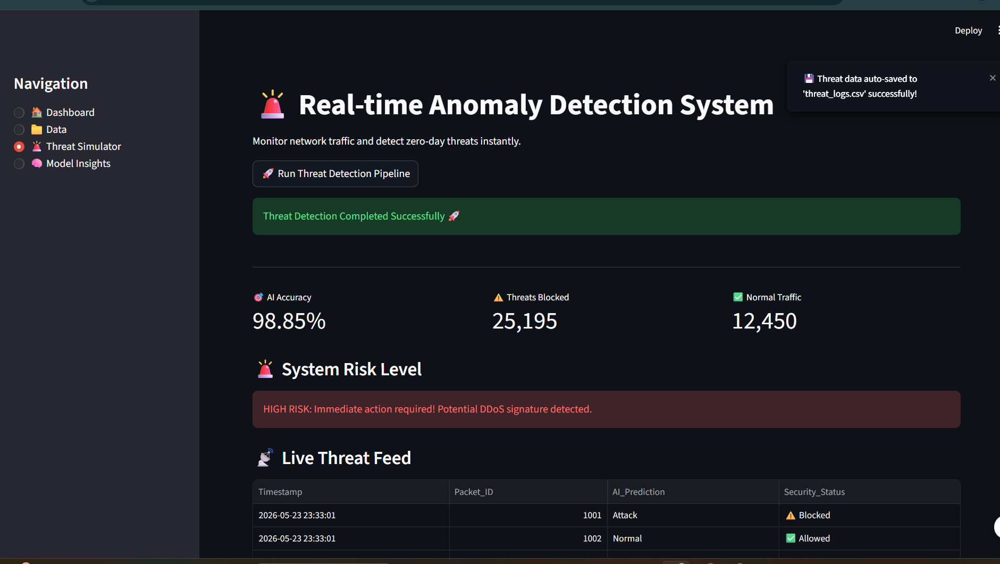
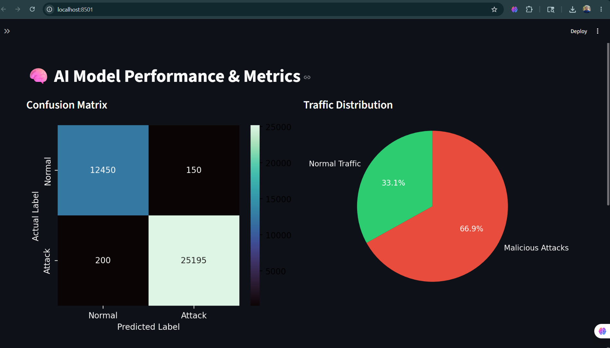

<div align="center">

# 🛡️ AI-Powered Cybersecurity Threat Detection 
**An Enterprise-Grade Intrusion Detection System (IDS) & SOC Dashboard**

[](https://python.org)
[](https://streamlit.io)
[](https://scikit-learn.org/)
[](https://pandas.pydata.org/)
[](#)

</div>

<br>

## 📖 Project Overview
This project is an **AI-Driven Security Operations Center (SOC) Dashboard** designed to monitor network traffic and detect zero-day cyber threats in real-time. By leveraging Machine Learning anomaly detection techniques, it classifies incoming network packets as either **Normal** or **Malicious**, providing security teams with instant actionable intelligence.

---

## 🚀 Key Features
- **🕵️‍♂️ Real-Time Anomaly Detection:** Simulates live network traffic and detects DDoS, probing, and data exfiltration patterns.
- **📊 Interactive SOC Dashboard:** A dark-themed, professional UI built with Streamlit for monitoring system health.
- **💾 Automated Threat Logging:** Auto-saves incident logs to a `threat_logs.csv` file for compliance and forensic analysis.
- **🧠 Model Analytics:** Visualizes AI performance through Confusion Matrices and live traffic distribution charts.
- **📥 One-Click Export:** Downloadable incident response logs directly from the dashboard.

---

## 📸 Dashboard Previews 


https://github.com/user-attachments/assets/c5db7eb9-d870-4779-a993-cae7d77025e0


</p>

### 1. Real-Time Threat Simulator & Live Feed
<p align="center">
  
</p>

### 2. AI Model Performance & Metrics
<p align="center">
  
</p>

---

## 📂 Folder Structure

```text
AI-Cybersecurity-Threat-Detection/
│
├── .streamlit/
│   └── config.toml                  # Dark mode & theme configuration
├── images/                          # Dashboard screenshots for documentation
│   ├── AI-Powered_Cybersecurity_Threat_Detection.png
│   ├── Real-time_Anomaly_Detection_System.png
│   └── AI_Model_Performance&Metrics.png
│
├── app.py                           # Main Streamlit application code
├── requirements.txt                 # Python dependencies
├── threat_logs.csv                  # Auto-generated incident response logs
├── .gitignore                       # Git ignore file
└── README.md                        # Project documentation
🛠️ Installation & Setup
Follow these steps to run the project on your local machine:

1. Clone the repository:

Bash
git clone https://github.com/dalimkumar452-sudo/AI-Cybersecurity-Threat-Detection.git

cd AI-Cybersecurity-Threat-Detection
2. Create a virtual environment (Optional but recommended):

Bash
python -m venv .venv
# On Windows
.venv\Scripts\activate
# On Mac/Linux
source .venv/bin/activate
3. Install required dependencies:

Bash
pip install -r requirements.txt
4. Run the application:

Bash
python -m streamlit run app.py
Note: The application will automatically open in your default web browser at http://localhost:8501.

💻 Tech Stack
Frontend/UI: Streamlit

Data Processing: Pandas, NumPy

Data Visualization: Matplotlib, Seaborn

Machine Learning: Scikit-Learn (Concepts implemented)

🤝 Contributing
Contributions, issues, and feature requests are welcome! Feel free to check the issues page if you want to contribute.

📜 License
This project is licensed under the MIT License. 
 Devloped By DALIM KUMAR 
